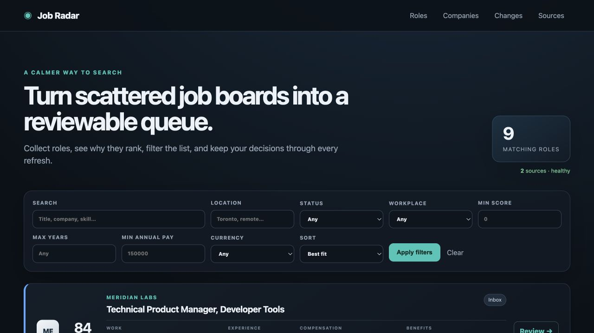
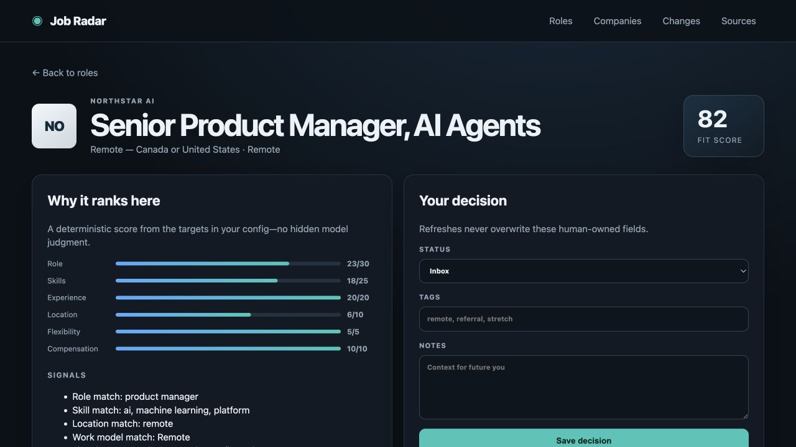
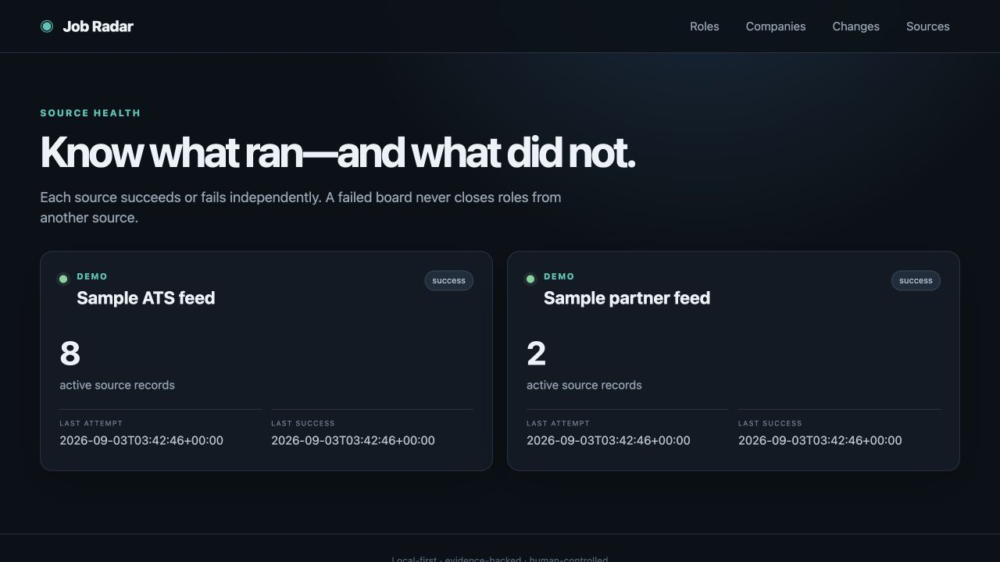
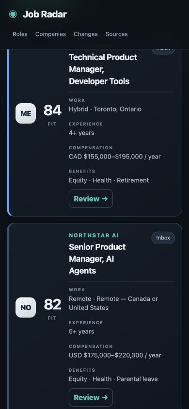

# Job Radar

Job Radar is a local job search platform that collects roles from public company job boards, removes conservative duplicates, extracts useful facts with evidence, ranks each role against a configurable target profile, and keeps personal application activity separate from source data.

It is built for the part of a job search that usually falls between dozens of browser tabs and a spreadsheet: understanding what is worth reviewing, remembering why, and seeing what changed after the next refresh.

> This repository is a privacy-safe standalone product. Its companies, roles, URLs, and activity are fictional. It contains no personal job-search records or private deployment history.



**See the output first:** [browse the static sample roles](docs/sample-output/sample-roles-2026.md) or [download the CSV](docs/sample-output/sample-roles-2026.csv). Both are generated from the fictional demo and deliberately exclude application status, notes, tags, contacts, personal settings, and full job descriptions.

## The primary workflow

1. **Configure targets.** Set role terms, skills, preferred locations and work models, experience, and a compensation floor in `config.yaml`.
2. **Collect roles.** Load the offline demo or refresh public Greenhouse, Lever, and Ashby boards.
3. **Understand the ranking.** Inspect the component score and exact text supporting experience, workplace, compensation, and benefits.
4. **Filter and compare.** Search by title, company, or skill; narrow by location, work model, experience, score, pay, currency, and status.
5. **Triage deliberately.** Shortlist, mark applied, dismiss, tag, and write notes. Refreshes cannot overwrite these fields.
6. **Review the market.** Compare companies, inspect day-over-day additions/edits/closures, and check source health.

<table>
<tr><td></td><td></td></tr>
<tr><td align="center"><em>Facts keep their source text.</em></td><td align="center"><em>One failed source cannot close another source's roles.</em></td></tr>
</table>

## Try it locally

Python 3.11+ is required. The default demo needs no account, network access, or API key.

```bash
python3.11 -m venv .venv
source .venv/bin/activate
pip install -e '.[dev]'
job-radar init-demo
job-radar serve
```

Open [http://127.0.0.1:8876](http://127.0.0.1:8876). The demo ingests ten fictional source records from two feeds and merges one duplicate into nine canonical roles.

The same demo runs in Docker:

```bash
docker build -t job-radar .
docker run --rm -p 8876:8876 job-radar
```

## Use public job boards

Copy `config.example.yaml` to `config.yaml`, adjust the target profile, and add public board tokens. GET requests to the supported job-board endpoints do not require application credentials.

```bash
cp config.example.yaml config.yaml
job-radar refresh-sources --config config.yaml
job-radar source-health
```

Supported sources:

- [Greenhouse Job Board API](https://docs.greenhouse.io/job-board.html)
- [Lever Postings API](https://github.com/lever/postings-api)
- [Ashby Job Postings API](https://developers.ashbyhq.com/docs/public-job-posting-api)

Each source is fetched and committed independently. A timeout, parse failure, or suspicious empty response is recorded as a failed run and leaves previously seen roles active. An intentionally empty board can opt in with `allow_empty: true`.

## How extraction works

Rules run first. They extract explicit facts and retain the supporting sentence, method, and confidence. The platform does not infer a workplace policy from vague phrases, convert currencies silently, or turn “preferred” experience into a binding minimum.

An optional LLM fallback can fill fields that remain missing. It is:

- off by default;
- called only for unresolved fields;
- behind a small provider interface, with an OpenAI-compatible adapter included;
- constrained to a JSON schema;
- rejected field by field unless every result cites an exact substring from the posting;
- fully mocked in tests, so CI never needs paid model access.

Enabling it is an explicit privacy decision because job text leaves the machine:

```yaml
llm_fallback:
  enabled: true
  endpoint: https://your-provider.example/v1/chat/completions
  model: your-model
  api_key_env: JOB_RADAR_LLM_API_KEY
```

## Data and decision boundaries

```text
public ATS boards ──→ source records ──→ conservative deduplication ──→ canonical roles
                                             │                              │
                                             │                       rules first
                                             │                              │
                                             └─ source health       cited facts + score
                                                                            │
human review ───────────────────────────────────────────────→ separate private state
                                                              status · tags · notes
```

- `job_sources` records what each board returned.
- `jobs` stores canonical roles, extracted facts, evidence, and deterministic score components.
- `human_state` stores user-owned status, tags, and notes; ingestion never writes it.
- `runs` and `changes` make source health and day-over-day changes auditable.

The [architecture note](docs/architecture.md) explains identity, failure, and persistence decisions in more detail.

## Quality checks

```bash
ruff check src tests
pytest --cov=job_radar
```

CI runs linting, unit/integration tests, coverage, and a Gitleaks scan. Tests cover source normalization, cross-source deduplication, idempotency, source-scoped closures, suspicious empty responses, failed-source preservation, extraction evidence, currency handling, mocked LLM fallback validation, filters, triage, CLI onboarding, and migration from the early demo schema.

The interface is also manually checked at a 390px viewport. Filters become a compact two-column form, role cards collapse to one-column facts, and the decision and evidence views remain fully usable.



## Deliberate limitations

- Deduplication is conservative: it merges normalized company + title + location matches. Near-duplicates with materially different location text remain separate to avoid collapsing distinct requisitions.
- Compensation is extracted only when a numeric range is explicit. USD and CAD remain distinct; Job Radar does not silently apply exchange rates.
- The bundled score is a transparent heuristic, not a prediction of interview success.
- The current web UI is single-user and local. Authentication and hosted multi-user deployment are out of scope.
- Greenhouse, Lever, and Ashby are supported; broader proprietary career sites need additional adapters.
- LLM fallback currently supports an OpenAI-compatible chat-completions transport. The extraction contract itself is provider-independent.

## Roadmap

1. Gold-fixture evaluation for extraction precision and recall
2. Published-at normalization and true freshness scoring
3. Salary-period normalization with explicit conversion assumptions
4. Saved views and keyboard-first triage
5. Export/import and optional encrypted backups

See the [privacy and release checklist](docs/privacy.md) before changing repository visibility.
